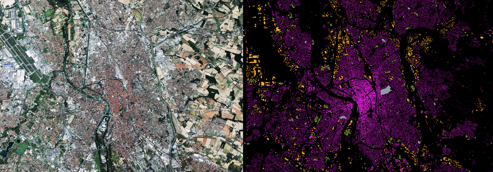
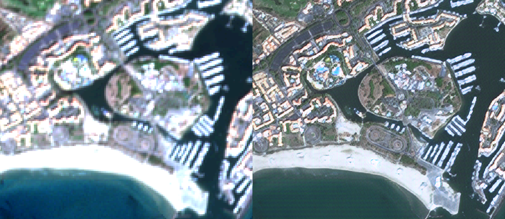

# OTBTF

This remote module of the [Orfeo ToolBox](https://www.orfeo-toolbox.org) provides a generic, multi purpose deep learning framework, targeting remote sensing images processing.
It contains a set of new process objects that internally invoke [Tensorflow](https://www.tensorflow.org/), and a bunch of user-oriented applications to perform deep learning with real-world remote sensing images.
Applications can be used to build OTB pipelines from Python or C++ APIs. 

*Main highlights*
 - Sampling,
 - Training, supporting save/restore/import operations (a model can be trained from scratch or fine-tuned),
 - Serving models with support of OTB streaming mechanism. Meaning (1) not limited by images sizes, (2) can be used as a "lego" in any OTB pipeline and preserve streaming, (3) MPI support available (use multiple processing unit to generate one single output image)

*Portfolio*

Below are some screen captures of deep learning applications performed at large scale with OTBTF.
 - Image to image translation (Spot-7 image --> Wikimedia Map using CGAN)


 - Landcover mapping (Spot-7 images --> Building map using semantic segmentation)


 - Image enhancement (Enhancement of Sentinel-2 images at 1.5m  using SRGAN)


You can read more details about these applications on [this blog](https://mdl4eo.irstea.fr/2019/)

# How to install

For now you have two options: either use the existing *docker image*, or build everything yourself *from source*.

# Docker
Use the latest image from dockerhub:
```
docker pull mdl4eo/otbtf1.6
docker run -u otbuser -v $(pwd):/home/otbuser mdl4eo/otbtf1.6 otbcli_PatchesExtraction -help
```
Please note that for now, TensorFlow and OTB are built with the minimal optimization flags, no CUDA/OpenCL enabled, no AVX and such for CPU. 
*Feel free to contribute, adding your own Dockerfile with CUDA support, etc!*

The dockerfiles corresponding to the images available on dockerhub are provided in the `tools/dockerfiles/` path of this repository.

# Build from sources
This remote module has been tested successfully on Ubuntu 18 and CentOs 7 with last CUDA drivers, TensorFlow r1.14 and OTB develop (0df44b312d64d6c3890b65d3790d4a17d0fd5f23).

## Build OTB
First, **build the latest *develop* branch of OTB from sources**. You can check the [OTB documentation](https://www.orfeo-toolbox.org/SoftwareGuide/SoftwareGuidech2.html) which details all the steps, if fact it is quite easy thank to the SuperBuild.

Basically, you have to create a folder for OTB, clone sources, configure OTB SuperBuild, and build it.
The following has been validated with an OTB 6.7.0.
```
sudo apt-get update
sudo apt-get upgrade
sudo apt-get install aptitude
sudo aptitude install make cmake-curses-gui build-essential libtool automake git libbz2-dev python-dev libboost-dev libboost-filesystem-dev libboost-serialization-dev libboost-system-dev zlib1g-dev libcurl4-gnutls-dev swig libkml-dev
sudo mkdir /work
sudo chown $USER /work
mkdir /work/otb
cd /work/otb
mkdir build
git clone https://gitlab.orfeo-toolbox.org/orfeotoolbox/otb.git OTB
cd build
ccmake /work/otb/OTB/SuperBuild
```
From here you can tell the SuperBuild to use system boost, curl, zlib, libkml for instance.

Then you can build it:
```
make -j $(grep -c ^processor /proc/cpuinfo)
```

## Build TensorFlow with shared libraries
During this step, you have to **build Tensorflow from source** except if you want to use only the sampling applications of OTBTensorflow (in this case, skip this section).
The following has been validated with TensorFlow r1.14 and gcc 5.3.1.

### Bazel
First, install Bazel.
```
sudo apt-get install pkg-config zip g++ zlib1g-dev unzip python
wget https://github.com/bazelbuild/bazel/releases/download/0.20.0/bazel-0.20.0-installer-linux-x86_64.sh
chmod +x bazel-0.20.0-installer-linux-x86_64.sh
./bazel-0.20.0-installer-linux-x86_64.sh --user
export PATH="$PATH:$HOME/bin"
```

If you fail to install properly Bazel, you can read the beginning of [the instructions](https://www.tensorflow.org/install/install_sources) that present alternative methods for this.

### Required packages
There is a few required packages that you need to install:
```
sudo apt install python-dev python-pip python3-dev python3-pip python3-mock
sudo pip install pip six numpy wheel mock keras
sudo pip3 install pip six numpy wheel mock keras
```

For a pure python3 install, you might need to workaround a bazel bug the following way:
```
sudo ln -s /usr/bin/python3 /usr/bin/python
```

### Build TensorFlow the right way
Now, let's build TensorFlow with all the stuff required by OTBTF.
Make a directory for TensorFlow.
For instance `mkdir /work/tf`.

Clone TensorFlow.
```
cd /work/tf
git clone https://github.com/tensorflow/tensorflow.git
```

Now configure the project. If you have CUDA and other NVIDIA stuff installed in your system, remember that you have to tell the script that it is in `/usr/` (no symlink required!).

```
cd tensorflow
./configure
```
Then, you have to build TensorFlow with the instructions sets supported by your CPU (For instance here is AVX, AVX2, FMA, SSE4.1, SSE4.2 that play fine on a modern intel CPU). You have to tell Bazel to build:

 1. The TensorFlow python pip package
 2. The libtensorflow_cc.so library
 3. The libtensorflow_framework.so library
```
bazel build -c opt --copt=-mavx --copt=-mavx2 --copt=-mfma --copt=-mfpmath=both --copt=-msse4.1 --copt=-msse4.2 //tensorflow:libtensorflow_framework.so //tensorflow:libtensorflow_cc.so //tensorflow:libtensorflow.so //tensorflow/tools/pip_package:build_pip_package
```

*You might fail this step (e.g. missing packages). In this case, it's recommended to clear the bazel cache, using something like `rm $HOME/.cache/bazel/* -rf` before configuring and building everything!*

### Prepare the right stuff to use TensorFlow in external (cmake) projects
This is the most important!
First, build and deploy the pip package.
```
bazel-bin/tensorflow/tools/pip_package/build_pip_package /tmp/tensorflow_pkg
pip install /tmp/tensorflow_pkg/tensorflow-1.12.0rc0-cp27-cp27mu-linux_x86_64.whl
```
For the C++ API, it's a bit more tricky.
Let's begin.
First, download dependencies.
```
/work/tf/tensorflow/tensorflow/contrib/makefile/download_dependencies.sh
```
Then, build Google Protobuf
```
mkdir /tmp/proto
cd /work/tf/tensorflow/tensorflow/contrib/makefile/downloads/protobuf/
./autogen.sh
./configure --prefix=/tmp/proto/
make -j $(grep -c ^processor /proc/cpuinfo)
make install
```
Then, "build" eigen (header only...)
```
mkdir /tmp/eigen
cd ../eigen
mkdir build_dir
cd build_dir
cmake -DCMAKE_INSTALL_PREFIX=/tmp/eigen/ ../
make install -j $(grep -c ^processor /proc/cpuinfo)
```
Then, build NSync
```
/work/tf/tensorflow/tensorflow/contrib/makefile/compile_nsync.sh
```
Then, build absl
```
mkdir /tmp/absl
cd /work/tf/tensorflow/tensorflow/contrib/makefile/downloads/absl/
mkdir build_dir
cd build_dir
cmake -DCMAKE_INSTALL_PREFIX=/tmp/absl ../
make -j $(grep -c ^processor /proc/cpuinfo)
```
Now, you have to copy the useful stuff in a directory

```
# Create folders
mkdir /work/tf/installdir
mkdir /work/tf/installdir/lib
mkdir /work/tf/installdir/include

# Copy libs
cp /work/tf/tensorflow/bazel-bin/tensorflow/libtensorflow_cc.so /work/tf/installdir/lib/
cp /work/tf/tensorflow/bazel-bin/tensorflow/libtensorflow_framework.so /work/tf/installdir/lib/
cp /tmp/proto/lib/libprotobuf.a /work/tf/installdir/lib/
cp /work/tf/tensorflow/tensorflow/contrib/makefile/downloads/nsync/builds/default.linux.c++11/*.a /work/tf/installdir/lib/
ln -s /work/tf/installdir/lib/libtensorflow_framework.so /work/tf/installdir/lib/libtensorflow_framework.so.1
ln -s /work/tf/installdir/lib/libtensorflow_cc.so /work/tf/installdir/lib/libtensorflow_cc.so.1

# Copy headers
mkdir /work/tf/installdir/include/tensorflow
cp -r /work/tf/tensorflow/bazel-genfiles/* /work/tf/installdir/include
cp -r /work/tf/tensorflow/tensorflow/cc /work/tf/installdir/include/tensorflow
cp -r /work/tf/tensorflow/tensorflow/core /work/tf/installdir/include/tensorflow
cp -r /work/tf/tensorflow/third_party /work/tf/installdir/include
cp -r /tmp/proto/include/* /work/tf/installdir/include
cp -r /tmp/eigen/include/eigen3/* /work/tf/installdir/include
cp /work/tf/tensorflow/tensorflow/contrib/makefile/downloads/nsync/public/* /work/tf/installdir/include/
cd /work/tf/tensorflow/tensorflow/contrib/makefile/downloads/absl
find absl/ -name '*.h' -exec cp --parents \{\} /work/tf/installdir/include/ \; 
find absl/ -name '*.inc' -exec cp --parents \{\} /work/tf/installdir/include/ \; 

# Cleaning
find /work/tf/installdir/ -name "*.cc" -type f -delete
```
Well done. Now you have a working copy of TensorFlow located in `/work/tf/installdir` that is ready to use in external C++ cmake projects :)

## Build this remote module
Finally, we can build this module.
Clone the repository in your the OTB sources directory for remote modules (something like `/work/otb/OTB/Modules/Remote/`).
Re configure OTB with cmake of ccmake, and set the following variables

 - **Module_OTBTensorflow** to **ON**
 - **OTB_USE_TENSORFLOW** to **ON** (if you set to OFF, you will have only the sampling applications)
 - **TENSORFLOW_CC_LIB** to `/work/tf/installdir/lib/libtensorflow_cc.so`
 - **TENSORFLOW_FRAMEWORK_LIB** to `/work/tf/installdir/lib/libtensorflow_framework.so`
 - **tensorflow_include_dir** to `/work/tf/installdir/include`

Re build and re install OTB.
```
cd /work/otb/build/OTB/build
ccmake
make -j $(grep -c ^processor /proc/cpuinfo)
```
Done !

# New applications
Let's describe quickly the new applications provided.
## PatchesExtraction
This application performs the extraction of patches in images from a vector data containing points. The OTB sampling framework can be used to generate the set of selected points. After that, you can use the **PatchesExtraction** application to perform the sampling of your images.
We denote input source an input image, or a stack of input image (of the same size !). The user can set the **OTB_TF_NSOURCES** environment variable to select the number of input sources that he wants. For example, if she wants to sample a time series of Sentinel or Landsat, and in addition a very high resolution image like Spot-7 or Rapideye (like the [M3 deep net](https://arxiv.org/pdf/1803.01945.pdf)), she needs 2 sources (1 for the TS and 1 for the VHRS). The sampled patches will be extracted at each positions designed by the points, if they are entirely inside all input images. For each image source, patches sizes must be provided.
For each source, the application export all sampled patches as a single multiband raster, stacked in rows. For instance, if you have a number *n* of samples of size *16 x 16* in a *4* channels source image, the output image will be a raster of size *16 x 16n* with *4* channels. 
An optional output is an image of size *1 x n* containing the value of one specific field of the input vector data. Typically, the *class* field can be used to generate a dataset suitable for a model that performs pixel wise classification. 


```
This application extracts patches in multiple input images. Change the OTB_TF_NSOURCES environment variable to set the number of sources.
Parameters: 
        -source1            <group>          Parameters for source 1 
MISSING -source1.il         <string list>    Input image(s) 1  (mandatory)
MISSING -source1.out        <string> [pixel] Output patches for image 1  [pixel=uint8/uint16/int16/uint32/int32/float/double/cint16/cint32/cfloat/cdouble] (default value is float) (mandatory)
MISSING -source1.patchsizex <int32>          X patch size for image 1  (mandatory)
MISSING -source1.patchsizey <int32>          Y patch size for image 1  (mandatory)
MISSING -vec                <string>         Positions of the samples (must be in the same projection as input image)  (mandatory)
        -outlabels          <string> [pixel] output labels  [pixel=uint8/uint16/int16/uint32/int32/float/double/cint16/cint32/cfloat/cdouble] (default value is uint8) (optional, off by default)
MISSING -field              <string>         field of class in the vector data  (mandatory)
        -inxml              <string>         Load otb application from xml file  (optional, off by default)
        -progress           <boolean>        Report progress 
        -help               <string list>    Display long help (empty list), or help for given parameters keys

Use -help param1 [... paramN] to see detailed documentation of those parameters.

Examples: 
otbcli_PatchesExtraction -vec points.sqlite -source1.il $s2_list -source1.patchsizex 16 -source1.patchsizey 16 -field class -source1.out outpatches_16x16.tif -outlabels outlabels.tif
```

## Build your Tensorflow model
You can build your Tensorflow model as shown in the `otb/Modules/Remote/otbtensorflow/python` directory. The high-level Python API of Tensorflow is used here to explort a *SavedModel* that applications of this remote module can read.
Python purists can even train their own models, thank to Python bindings of OTB: to get patches as 4D numpy arrays, just read the patches images with OTB (**ExtractROI** application for instance) and get the output float vector image as numpy array. Then, simply do a np.reshape to the dimensions that you want ! 
However, you can use any deep net available on the web, or use an existing gui application to create your own Tensorflow models.
The important thing here is to know the following parameters for your **placeholders** (the inputs of your model) and **output tensors** (the outputs of your model).
 - For each **input placeholder**:
   - Name
   - Receptive field
 - For each **output tensor**:
   - Name 
   - Expression field
   - Scale factor


Here the scale factor is related to one of the model inputs. It tells if your model perform a physical change of spacing of the output (e.g. introduced by non unitary strides in pooling or convolution operators). For each output, it must be expressed relatively to one single input called the reference input.
Additionally, you will need to remember the **target nodes** (e.g. optimizers, ...) used for training and every other placeholder that are important, especially user placeholders that are used only for training without default value (e.g. "dropout value").

## Train your Tensorflow model
Here we assume that you have produced patches using the **PatchesExtraction** application, and that you have a model stored in a directory somewhere on your filesystem. The **TensorflowModelTrain** performs the training, validation (against test dataset, and against validation dataset) providing the usual metrics that machine learning frameworks provide (confusion matrix, recall, precision, f-score, ...).
Set you input data for training and for validation. The validation against test data is performed on the same data as for training, and the validation against the validation data, well, is performed on the dataset that you give to the application. You can set also batches sizes, and custom placeholders for single valued tensors for both training and validation. The last is useful if you have a model that behaves differently depending the given placeholder. Let's take the example of dropout: it's nice for training, but you have to disable it to use the model. Hence you will pass a placeholder with dropout=0.3 for training and dropout=0.0 for validation. 


```
Train a multisource deep learning net using Tensorflow. Change the OTB_TF_NSOURCES environment variable to set the number of sources.
Parameters: 
        -model                        <group>          Model parameters 
MISSING -model.dir                    <string>         Tensorflow model_save directory  (mandatory)
        -model.restorefrom            <string>         Restore model from path  (optional, off by default)
        -model.saveto                 <string>         Save model to path  (optional, off by default)
        -training                     <group>          Training parameters 
        -training.batchsize           <int32>          Batch size  (mandatory, default value is 100)
        -training.epochs              <int32>          Number of epochs  (mandatory, default value is 100)
        -training.userplaceholders    <string list>    Additional single-valued placeholders for training. Supported types: int, float, bool.  (optional, off by default)
MISSING -training.targetnodes         <string list>    Names of the target nodes  (mandatory)
        -training.outputtensors       <string list>    Names of the output tensors to display  (optional, off by default)
        -training.usestreaming        <boolean>        Use the streaming through patches (slower but can process big dataset)  (optional, off by default, default value is false)
        -training.source1             <group>          Parameters for source #1 (training) 
MISSING -training.source1.il          <string list>    Input image (or list to stack) for source #1 (training)  (mandatory)
MISSING -training.source1.patchsizex  <int32>          Patch size (x) for source #1  (mandatory)
MISSING -training.source1.patchsizey  <int32>          Patch size (y) for source #1  (mandatory)
MISSING -training.source1.placeholder <string>         Name of the input placeholder for source #1 (training)  (mandatory)
        -training.source2             <group>          Parameters for source #2 (training) 
MISSING -training.source2.il          <string list>    Input image (or list to stack) for source #2 (training)  (mandatory)
MISSING -training.source2.patchsizex  <int32>          Patch size (x) for source #2  (mandatory)
MISSING -training.source2.patchsizey  <int32>          Patch size (y) for source #2  (mandatory)
MISSING -training.source2.placeholder <string>         Name of the input placeholder for source #2 (training)  (mandatory)
        -validation                   <group>          Validation parameters 
        -validation.step              <int32>          Perform the validation every Nth epochs  (mandatory, default value is 10)
        -validation.mode              <string>         Metrics to compute [none/class/rmse] (mandatory, default value is none)
        -validation.userplaceholders  <string list>    Additional single-valued placeholders for validation. Supported types: int, float, bool.  (optional, off by default)
        -validation.usestreaming      <boolean>        Use the streaming through patches (slower but can process big dataset)  (optional, off by default, default value is false)
        -validation.source1           <group>          Parameters for source #1 (validation) 
        -validation.source1.il        <string list>    Input image (or list to stack) for source #1 (validation)  (mandatory)
        -validation.source1.name      <string>         Name of the input placeholder or output tensor for source #1 (validation)  (mandatory)
        -validation.source2           <group>          Parameters for source #2 (validation) 
        -validation.source2.il        <string list>    Input image (or list to stack) for source #2 (validation)  (mandatory)
        -validation.source2.name      <string>         Name of the input placeholder or output tensor for source #2 (validation)  (mandatory)
        -inxml                        <string>         Load otb application from xml file  (optional, off by default)
        -progress                     <boolean>        Report progress 
        -help                         <string list>    Display long help (empty list), or help for given parameters keys

Use -help param1 [... paramN] to see detailed documentation of those parameters.

Examples: 
otbcli_TensorflowModelTrain -source1.il spot6pms.tif -source1.placeholder x1 -source1.patchsizex 16 -source1.patchsizey 16 -source2.il labels.tif -source2.placeholder y1 -source2.patchsizex 1 -source2.patchsizex 1 -model.dir /tmp/my_saved_model/ -training.userplaceholders is_training=true dropout=0.2 -training.targetnodes optimizer -model.saveto /tmp/my_saved_model_vars1
```

As you can note, there is `$OTB_TF_NSOURCES` + 1 sources for practical purpose: because we need at least 1 source for input data, and 1 source for the truth.
## Serve the model
The **TensorflowModelServe** application perform model serving, it can be used to produce output raster with the desired tensors. Thanks to the streaming mechanism, very large images can be produced. The application uses the `TensorflowModelFilter` and a `StreamingFilter` to force the streaming of output. This last can be optionally disabled by the user, if he prefers using the extended filenames to deal with chunk sizes. however, it's still very useful when the application is used in other composites applications, or just without extended filename magic. Some models can consume a lot of memory. In addition, the native tiling strategy of OTB consists in strips but this might not always the best. For Convolutional Neural Networks for instance, square tiles are more interesting because the padding required to perform the computation of one single strip of pixels induces to input a lot more pixels that to process the computation of one single tile of pixels.
So, this application takes in input one or multiple images (remember that you can change the number of inputs by setting the `OTB_TF_NSOURCES` to the desired number) and produce one output of the specified tensors.
Like it was said before, the user is responsible of giving the *receptive field* and *name* of input placeholders, as well as the *expression field*, *scale factor* and *name* of the output tensors. The user can ask for multiple tensors, that will be stack along the channel dimension of the output raster. However, if the sizes of those output tensors are not consistent (e.g. a different number of (x,y) elements), an exception will be thrown.


```
Multisource deep learning classifier using TensorFlow. Change the OTB_TF_NSOURCES environment variable to set the number of sources.
Parameters: 
        -source1                <group>          Parameters for source #1 
MISSING -source1.il             <string list>    Input image (or list to stack) for source #1  (mandatory)
MISSING -source1.rfieldx        <int32>          Input receptive field (width) for source #1  (mandatory)
MISSING -source1.rfieldy        <int32>          Input receptive field (height) for source #1  (mandatory)
MISSING -source1.placeholder    <string>         Name of the input placeholder for source #1  (mandatory)
        -model                  <group>          model parameters 
MISSING -model.dir              <string>         TensorFlow model_save directory  (mandatory)
        -model.userplaceholders <string list>    Additional single-valued placeholders. Supported types: int, float, bool.  (optional, off by default)
        -model.fullyconv        <boolean>        Fully convolutional  (optional, off by default, default value is false)
        -output                 <group>          Output tensors parameters 
        -output.spcscale        <float>          The output spacing scale, related to the first input  (mandatory, default value is 1)
MISSING -output.names           <string list>    Names of the output tensors  (mandatory)
        -output.efieldx         <int32>          The output expression field (width)  (mandatory, default value is 1)
        -output.efieldy         <int32>          The output expression field (height)  (mandatory, default value is 1)
        -optim                  <group>          This group of parameters allows optimization of processing time 
        -optim.disabletiling    <boolean>        Disable tiling  (optional, off by default, default value is false)
        -optim.tilesizex        <int32>          Tile width used to stream the filter output  (mandatory, default value is 16)
        -optim.tilesizey        <int32>          Tile height used to stream the filter output  (mandatory, default value is 16)
MISSING -out                    <string> [pixel] output image  [pixel=uint8/uint16/int16/uint32/int32/float/double/cint16/cint32/cfloat/cdouble] (default value is float) (mandatory)
        -inxml                  <string>         Load otb application from xml file  (optional, off by default)
        -progress               <boolean>        Report progress 
        -help                   <string list>    Display long help (empty list), or help for given parameters keys

Use -help param1 [... paramN] to see detailed documentation of those parameters.

Examples: 
otbcli_TensorflowModelServe -source1.il spot6pms.tif -source1.placeholder x1 -source1.rfieldx 16 -source1.rfieldy 16 -model.dir /tmp/my_saved_model/ -model.userplaceholders is_training=false dropout=0.0 -output.names out_predict1 out_proba1 -out "classif128tgt.tif?&streaming:type=tiled&streaming:sizemode=height&streaming:sizevalue=256"
```

## Composite applications for classification
Who has never dreamed to use classic classifiers performing on deep learning features?
This is possible thank to two new applications that uses the existing training/classification applications of OTB:

**TrainClassifierFromDeepFeatures**: is a composite application that wire the **TensorflowModelServe** application output into the existing official **TrainImagesClassifier** application. 
```
Train a classifier from deep net based features of an image and training vector data.
Parameters: 
        -source1                     <group>          Parameters for source 1 
MISSING -source1.il                  <string list>    Input image (or list to stack) for source #1  (mandatory)
MISSING -source1.rfieldx             <int32>          Input receptive field (width) for source #1  (mandatory)
MISSING -source1.rfieldy             <int32>          Input receptive field (height) for source #1  (mandatory)
MISSING -source1.placeholder         <string>         Name of the input placeholder for source #1  (mandatory)
        -model                       <group>          Deep net inputs parameters 
MISSING -model.dir                   <string>         TensorFlow model_save directory  (mandatory)
        -model.userplaceholders      <string list>    Additional single-valued placeholders. Supported types: int, float, bool.  (optional, off by default)
        -model.fullyconv             <boolean>        Fully convolutional  (optional, off by default, default value is false)
        -output                      <group>          Deep net outputs parameters 
        -output.spcscale             <float>          The output spacing scale, related to the first input  (mandatory, default value is 1)
MISSING -output.names                <string list>    Names of the output tensors  (mandatory)
        -output.efieldx              <int32>          The output expression field (width)  (mandatory, default value is 1)
        -output.efieldy              <int32>          The output expression field (height)  (mandatory, default value is 1)
        -optim                       <group>          Processing time optimization 
        -optim.disabletiling         <boolean>        Disable tiling  (optional, off by default, default value is false)
        -optim.tilesizex             <int32>          Tile width used to stream the filter output  (mandatory, default value is 16)
        -optim.tilesizey             <int32>          Tile height used to stream the filter output  (mandatory, default value is 16)
        -ram                         <int32>          Available RAM (Mb)  (optional, off by default, default value is 128)
MISSING -vd                          <string list>    Vector data for training  (mandatory)
        -valid                       <string list>    Vector data for validation  (optional, off by default)
MISSING -out                         <string>         Output classification model  (mandatory)
        -confmatout                  <string>         Output confusion matrix  (optional, off by default)
        -sample                      <group>          Sampling parameters 
        -sample.mt                   <int32>          Maximum training sample size per class  (mandatory, default value is 1000)
        -sample.mv                   <int32>          Maximum validation sample size per class  (mandatory, default value is 1000)
        -sample.bm                   <int32>          Bound sample number by minimum  (mandatory, default value is 1)
        -sample.vtr                  <float>          Training and validation sample ratio  (mandatory, default value is 0.5)
        -sample.vfn                  <string>         Field containing the class integer label for supervision  (mandatory, no default value)
        -elev                        <group>          Elevation parameters 
        -elev.dem                    <string>         DEM directory  (optional, off by default)
        -elev.geoid                  <string>         Geoid File  (optional, off by default)
        -elev.default                <float>          Default elevation  (mandatory, default value is 0)
        -classifier                  <string>         Classifier parameters [libsvm/boost/dt/gbt/ann/bayes/rf/knn/sharkrf/sharkkm] (mandatory, default value is libsvm)
        -classifier.libsvm.k         <string>         SVM Kernel Type [linear/rbf/poly/sigmoid] (mandatory, default value is linear)
        -classifier.libsvm.m         <string>         SVM Model Type [csvc/nusvc/oneclass] (mandatory, default value is csvc)
        -classifier.libsvm.c         <float>          Cost parameter C  (mandatory, default value is 1)
        -classifier.libsvm.nu        <float>          Cost parameter Nu  (mandatory, default value is 0.5)
        -classifier.libsvm.opt       <boolean>        Parameters optimization  (mandatory, default value is false)
        -classifier.libsvm.prob      <boolean>        Probability estimation  (mandatory, default value is false)
        -classifier.boost.t          <string>         Boost Type [discrete/real/logit/gentle] (mandatory, default value is real)
        -classifier.boost.w          <int32>          Weak count  (mandatory, default value is 100)
        -classifier.boost.r          <float>          Weight Trim Rate  (mandatory, default value is 0.95)
        -classifier.boost.m          <int32>          Maximum depth of the tree  (mandatory, default value is 1)
        -classifier.dt.max           <int32>          Maximum depth of the tree  (mandatory, default value is 65535)
        -classifier.dt.min           <int32>          Minimum number of samples in each node  (mandatory, default value is 10)
        -classifier.dt.ra            <float>          Termination criteria for regression tree  (mandatory, default value is 0.01)
        -classifier.dt.cat           <int32>          Cluster possible values of a categorical variable into K <= cat clusters to find a suboptimal split  (mandatory, default value is 10)
        -classifier.dt.f             <int32>          K-fold cross-validations  (mandatory, default value is 10)
        -classifier.dt.r             <boolean>        Set Use1seRule flag to false  (mandatory, default value is false)
        -classifier.dt.t             <boolean>        Set TruncatePrunedTree flag to false  (mandatory, default value is false)
        -classifier.gbt.w            <int32>          Number of boosting algorithm iterations  (mandatory, default value is 200)
        -classifier.gbt.s            <float>          Regularization parameter  (mandatory, default value is 0.01)
        -classifier.gbt.p            <float>          Portion of the whole training set used for each algorithm iteration  (mandatory, default value is 0.8)
        -classifier.gbt.max          <int32>          Maximum depth of the tree  (mandatory, default value is 3)
        -classifier.ann.t            <string>         Train Method Type [back/reg] (mandatory, default value is reg)
        -classifier.ann.sizes        <string list>    Number of neurons in each intermediate layer  (mandatory)
        -classifier.ann.f            <string>         Neuron activation function type [ident/sig/gau] (mandatory, default value is sig)
        -classifier.ann.a            <float>          Alpha parameter of the activation function  (mandatory, default value is 1)
        -classifier.ann.b            <float>          Beta parameter of the activation function  (mandatory, default value is 1)
        -classifier.ann.bpdw         <float>          Strength of the weight gradient term in the BACKPROP method  (mandatory, default value is 0.1)
        -classifier.ann.bpms         <float>          Strength of the momentum term (the difference between weights on the 2 previous iterations)  (mandatory, default value is 0.1)
        -classifier.ann.rdw          <float>          Initial value Delta_0 of update-values Delta_{ij} in RPROP method  (mandatory, default value is 0.1)
        -classifier.ann.rdwm         <float>          Update-values lower limit Delta_{min} in RPROP method  (mandatory, default value is 1e-07)
        -classifier.ann.term         <string>         Termination criteria [iter/eps/all] (mandatory, default value is all)
        -classifier.ann.eps          <float>          Epsilon value used in the Termination criteria  (mandatory, default value is 0.01)
        -classifier.ann.iter         <int32>          Maximum number of iterations used in the Termination criteria  (mandatory, default value is 1000)
        -classifier.rf.max           <int32>          Maximum depth of the tree  (mandatory, default value is 5)
        -classifier.rf.min           <int32>          Minimum number of samples in each node  (mandatory, default value is 10)
        -classifier.rf.ra            <float>          Termination Criteria for regression tree  (mandatory, default value is 0)
        -classifier.rf.cat           <int32>          Cluster possible values of a categorical variable into K <= cat clusters to find a suboptimal split  (mandatory, default value is 10)
        -classifier.rf.var           <int32>          Size of the randomly selected subset of features at each tree node  (mandatory, default value is 0)
        -classifier.rf.nbtrees       <int32>          Maximum number of trees in the forest  (mandatory, default value is 100)
        -classifier.rf.acc           <float>          Sufficient accuracy (OOB error)  (mandatory, default value is 0.01)
        -classifier.knn.k            <int32>          Number of Neighbors  (mandatory, default value is 32)
        -classifier.sharkrf.nbtrees  <int32>          Maximum number of trees in the forest  (mandatory, default value is 100)
        -classifier.sharkrf.nodesize <int32>          Min size of the node for a split  (mandatory, default value is 25)
        -classifier.sharkrf.mtry     <int32>          Number of features tested at each node  (mandatory, default value is 0)
        -classifier.sharkrf.oobr     <float>          Out of bound ratio  (mandatory, default value is 0.66)
        -classifier.sharkkm.maxiter  <int32>          Maximum number of iteration for the kmeans algorithm.  (mandatory, default value is 10)
        -classifier.sharkkm.k        <int32>          The number of class used for the kmeans algorithm.  (mandatory, default value is 2)
        -rand                        <int32>          User defined random seed  (optional, off by default)
        -inxml                       <string>         Load otb application from xml file  (optional, off by default)
        -progress                    <boolean>        Report progress 
        -help                        <string list>    Display long help (empty list), or help for given parameters keys

Use -help param1 [... paramN] to see detailed documentation of those parameters.

Examples: 
None
```

**ImageClassifierFromDeepFeatures** same approach with the official **ImageClassifier**.

```
Classify image using features from a deep net and an OTB machine learning classification model
Parameters: 
        -source1                    <group>          Parameters for source 1 
MISSING -source1.il                 <string list>    Input image (or list to stack) for source #1  (mandatory)
MISSING -source1.rfieldx            <int32>          Input receptive field (width) for source #1  (mandatory)
MISSING -source1.rfieldy            <int32>          Input receptive field (height) for source #1  (mandatory)
MISSING -source1.placeholder        <string>         Name of the input placeholder for source #1  (mandatory)
        -deepmodel                  <group>          Deep net model parameters 
MISSING -deepmodel.dir              <string>         TensorFlow model_save directory  (mandatory)
        -deepmodel.userplaceholders <string list>    Additional single-valued placeholders. Supported types: int, float, bool.  (optional, off by default)
        -deepmodel.fullyconv        <boolean>        Fully convolutional  (optional, off by default, default value is false)
        -output                     <group>          Deep net outputs parameters 
        -output.spcscale            <float>          The output spacing scale, related to the first input  (mandatory, default value is 1)
MISSING -output.names               <string list>    Names of the output tensors  (mandatory)
        -output.efieldx             <int32>          The output expression field (width)  (mandatory, default value is 1)
        -output.efieldy             <int32>          The output expression field (height)  (mandatory, default value is 1)
        -optim                      <group>          This group of parameters allows optimization of processing time 
        -optim.disabletiling        <boolean>        Disable tiling  (optional, off by default, default value is false)
        -optim.tilesizex            <int32>          Tile width used to stream the filter output  (mandatory, default value is 16)
        -optim.tilesizey            <int32>          Tile height used to stream the filter output  (mandatory, default value is 16)
MISSING -model                      <string>         Model file  (mandatory)
        -imstat                     <string>         Statistics file  (optional, off by default)
        -nodatalabel                <int32>          Label mask value  (optional, off by default, default value is 0)
MISSING -out                        <string> [pixel] Output image  [pixel=uint8/uint16/int16/uint32/int32/float/double/cint16/cint32/cfloat/cdouble] (default value is uint8) (mandatory)
        -confmap                    <string> [pixel] Confidence map image  [pixel=uint8/uint16/int16/uint32/int32/float/double/cint16/cint32/cfloat/cdouble] (default value is double) (optional, off by default)
        -ram                        <int32>          Ram  (optional, off by default, default value is 128)
        -inxml                      <string>         Load otb application from xml file  (optional, off by default)
        -progress                   <boolean>        Report progress 
        -help                       <string list>    Display long help (empty list), or help for given parameters keys

Use -help param1 [... paramN] to see detailed documentation of those parameters.

Examples: 
None
```

Note that you can still set the `OTB_TF_NSOURCES` environment variable.
Some examples and tutorial are coming soon for this part :)
# Practice
Here we will try to provide a simple example of doing a classification using a deep net that performs on one single VHRS image.
Our data set consists in one Spot-7 image, *spot7.tif*, and a training vector data, *terrain_truth.shp* that qualifies two classes that are forest / non-forest.
First, we **compute statistics** of the vector data : how many points can we sample inside objects, and how many objects in each class.
```
otbcli_PolygonClassStatistics -vec terrain_truth.shp -field class -in spot7.tif -out vec_stats.xml
```
Then, we will select some samples with the **SampleSelection** application of the existing machine learning framework of OTB.
```
otbcli_SampleSelection -in spot7.tif -vec terrain_truth.shp -instats vec_stats.xml -field class -out points.shp
```
Ok. Now, let's use our **PatchesExtraction** application. Out model has a receptive field of 16x16 pixels. 
We want to produce one image of patches, and one image for the corresponding labels.
```
otbcli_PatchesExtraction -source1.il spot7.tif -source1.patchsizex 16 -source1.patchsizey 16 -vec points.shp -field class -source1.out samp_labels.tif -outpatches samp_patches.tif
```
That's it. Now we have two images for patches and labels. We can split them to distinguish test/validation groups (with the **ExtractROI** application for instance). But here, we will just perform some fine tuning of our model, located in the `outmodel` directory. Our model is quite basic. It has two input placeholders, **x1** and **y1** respectively for input patches (with size 16x16) and input reference labels (with size 1x1). We named **prediction** the tensor that predict the labels and the optimizer that perform the stochastic gradient descent is an operator named **optimizer**. We perform the fine tuning and we export the new model variables in the `newvars` folder.
Let's use our **TensorflowModelTrain** application to perform the training of this existing model.
```
otbcli_TensorflowModelTrain -model.dir /path/to/oursavedmodel -training.targetnodesnames optimizer -training.source1.il samp_patches.tif -training.source1.patchsizex 16 -training.source1.patchsizey 16 -training.source1.placeholder x1 -training.source2.il samp_labels.tif -training.source2.patchsizex 1 -training.source2.patchsizey 1 -training.source2.placeholder y1 -model.saveto newvars
```
Note that we could also have performed validation in this step. In this case, the `validation.source2.placeholder` would be different than the `training.source2.placeholder`, and would be **prediction**. This way, the program know what is the target tensor to evaluate. 

After this step, we decide to produce an entire map of forest over the whole Spot-7 image. First, we duplicate the model, and we replace its variable with the new ones that have been computed in the previous step.
Then, we use the **TensorflowModelServe** application to produce the **prediction** tensor output for the entire image.
```
otbcli_TensorflowModelServe -source1.il spot7.tif -source1.placeholder x1 -source1.rfieldx 16 -source1.rfieldy 16 -model.dir /tmp/my_new_model -output.names prediction -out map.tif uint8
```
# Tutorial
A complete tutorial is available at [MDL4EO's blog](https://mdl4eo.irstea.fr/2019/01/04/an-introduction-to-deep-learning-on-remote-sensing-images-tutorial/)
# Contact
You can contact Remi Cresson if you have any issues with this remote module at remi [dot] cresson [at] irstea [dot] fr

