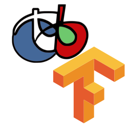
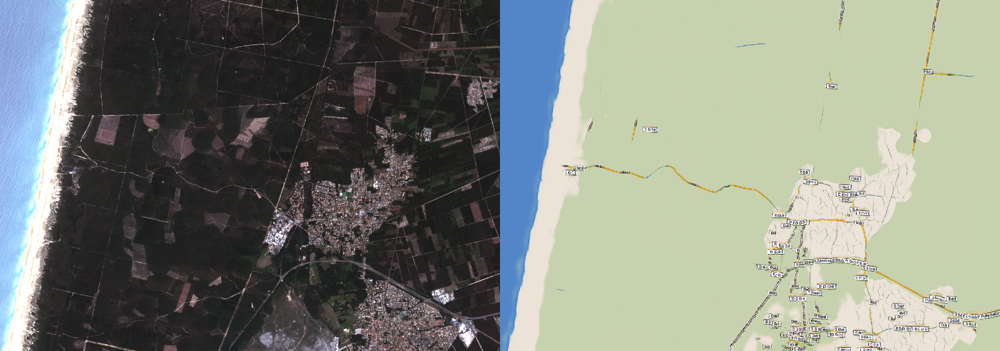

#  OTBTF

[](https://opensource.org/licenses/Apache-2.0)

## Orfeo ToolBox meets TensorFlow

This remote module of the [Orfeo ToolBox](https://www.orfeo-toolbox.org) provides a generic, multi purpose deep learning framework, targeting remote sensing images processing.
It contains a set of new process objects that internally invoke [Tensorflow](https://www.tensorflow.org/), and a bunch of user-oriented applications to perform deep learning with real-world remote sensing images.
Applications can be used to build OTB pipelines from Python or C++ APIs. 

### Highlights
 - Sampling,
 - Training, supporting save/restore/import operations (a model can be trained from scratch or fine-tuned),
 - Serving models with support of OTB streaming mechanism. Meaning (1) not limited by images sizes, (2) can be used as a "lego" in any OTB pipeline and preserve streaming, (3) MPI support available (use multiple processing unit to generate one single output image)

### Portfolio

Below are some screen captures of deep learning applications performed at large scale with OTBTF.
 - Image to image translation (Spot-7 image --> Wikimedia Map using CGAN)


 - Landcover mapping (Spot-7 images --> Building map using semantic segmentation)


 - Image enhancement (Enhancement of Sentinel-2 images at 1.5m  using SRGAN)


You can read more details about these applications on [this blog](https://mdl4eo.irstea.fr/2019/)

## How to install

For now you have two options: either use the existing **docker image**, or build everything yourself **from source**.

### Docker image

Use the latest image from dockerhub:
```
docker pull mdl4eo/otbtf2.4:cpu
docker run -u otbuser -v $(pwd):/home/otbuser mdl4eo/otbtf2.4:cpu otbcli_PatchesExtraction -help
```

Available docker images:

| Name                        | Os            | TF     | OTB   | Description            |
| --------------------------- | ------------- | ------ | ----- | ---------------------- |
| **mdl4eo/otbtf1.6:cpu**     | Ubuntu Xenial | r1.14  | 7.0.0 | CPU, no optimization   |
| **mdl4eo/otbtf1.7:cpu**     | Ubuntu Xenial | r1.14  | 7.0.0 | CPU, no optimization   |
| **mdl4eo/otbtf1.7:gpu**     | Ubuntu Xenial | r1.14  | 7.0.0 | GPU                    |
| **mdl4eo/otbtf2.0:cpu**     | Ubuntu Xenial | r2.1   | 7.1.0 | CPU, no optimization   |
| **mdl4eo/otbtf2.0:gpu**     | Ubuntu Xenial | r2.1   | 7.1.0 | GPU                    |
| **mdl4eo/otbtf2.4:cpu**     | Ubuntu Focal  | r2.4   | 7.2.0 | CPU, no optimization   |
| **mdl4eo/otbtf2.4:cpu-mkl** | Ubuntu Focal  | r2.4   | 7.2.0 | CPU, with Intel MKL    |
| **mdl4eo/otbtf2.4:gpu**     | Ubuntu Focal  | r2.4   | 7.2.0 | GPU                    |

(You can also find plenty of OTBTF flavored images [here](https://gitlab.com/latelescop/docker/otbtf/container_registry/)).

All GPU docker images are suited for **NVIDIA GPUs**. 
They use CUDA/CUDNN support and are built with compute capabilities 5.2, 6.1, 7.0, 7.5. 
To change the compute capabilities, you can build your own docker image using the provided dockerfile. See the [docker build documentation} (tools/dockerfiles).
You can find more details on the **GPU docker image** and some **docker tips and tricks** on [this blog](https://mdl4eo.irstea.fr/2019/10/15/otbtf-docker-image-with-gpu/). 
Also you can check [this document](https://gitlab.irstea.fr/raffaele.gaetano/moringa/-/tree/develop/docker) that also mentions useful stuff.


### Build from sources

See [here](doc/HOWTOBUILD.md) to see how to build the remote module from sources.

## How to use it?

### Documentation

Reading [the documentation](doc/APPLICATIONS.md) will help, of course 😉

### Tutorial

A small tutorial is available at [MDL4EO's blog](https://mdl4eo.irstea.fr/2019/01/04/an-introduction-to-deep-learning-on-remote-sensing-images-tutorial/)

### Ready-to-train models and open datasets

Check [our repository](https://github.com/remicres/otbtf_tutorials_resources) containing stuff (data and models) to begin with with!

Also, in the `python` folder are provided some [ready-to-use deep networks, with documentation and scientific references](doc/EXAMPLES.md).
**Feel free to contribute with your own architecture!**
